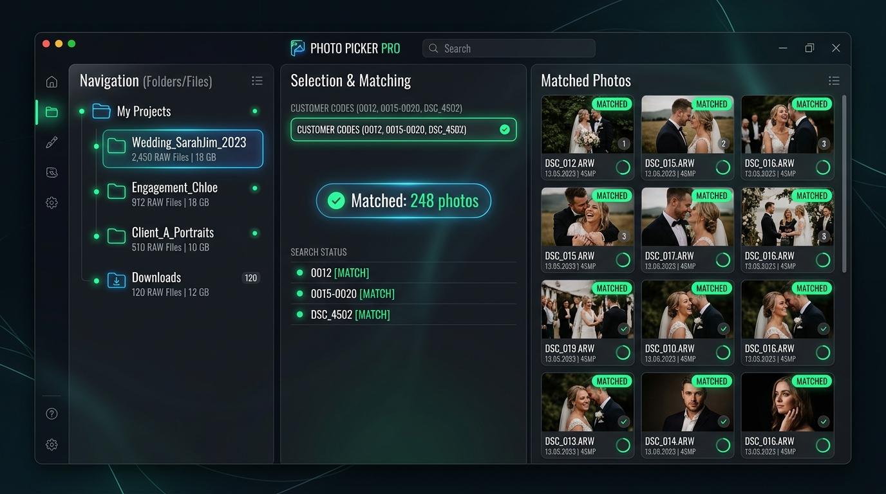
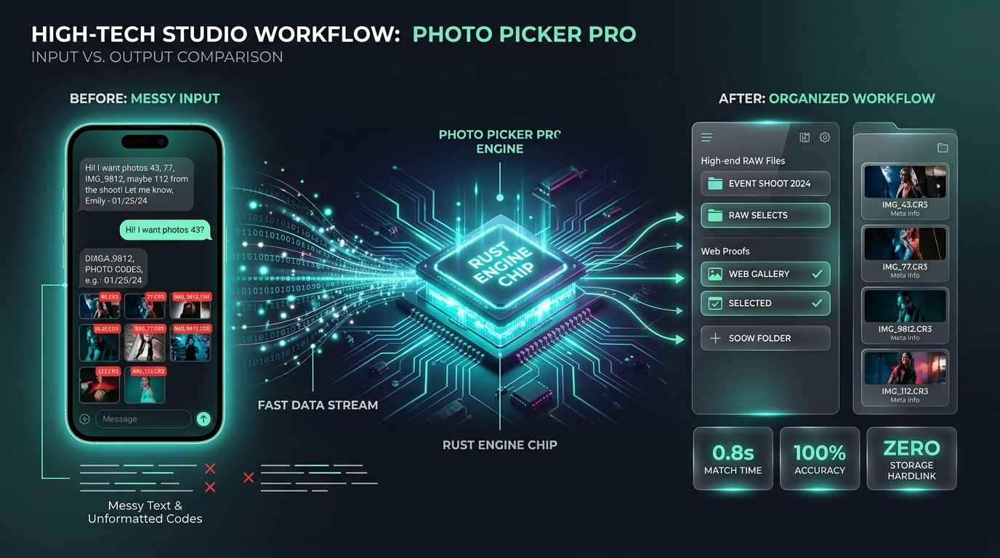
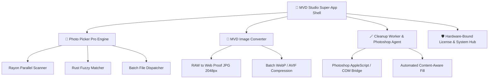

<div align="center">


# 📸 Photo Picker Pro
### *Next-Generation High-Speed Photo Filtering & Studio Workflow Automation Engine*

[](https://tauri.app)
[](https://www.rust-lang.org)
[](https://react.dev)
[](https://www.typescriptlang.org)
[](https://tailwindcss.com)
[](https://opensource.org/licenses/MIT)
[](https://github.com)

<p align="center">
  <b>⚡ Scan 100,000+ RAW photos in &lt; 2 seconds</b> • 
  <b>🧠 Smart Fuzzy Code Parser</b> • 
  <b>🔒 100% Offline & Private</b> • 
  <b>🎯 Sub-Millisecond Matching</b> • 
  <b>🧩 Modular Super-App Architecture</b>
</p>

[✨ Key Features](#-key-features) •
[🚀 Quick Start](#-quick-start) •
[🏗️ Architecture](#-architecture) •
[📊 Benchmarks](#-performance-benchmarks) •
[📷 Supported Formats](#-supported-raw--raster-formats) •
[⚖️ License & Copyright](#️-copyright--license)

<br/>



</div>

<br/>

## 🌟 Overview

**Photo Picker Pro** is a high-performance, studio-grade desktop application engineered specifically for **Wedding Studios, Event Photographers, Commercial Editors, and Photo Labs**.

When clients select photos from a shoot, they often send chaotic, unformatted lists across Zalo, Messenger, WhatsApp, or Excel (e.g., `12, 15-20, DSC_9901, anh dep 0401..0415`). Manually searching and copying these files among **50,000+ high-resolution RAW photos** takes hours of tedious, error-prone labor.

**Photo Picker Pro eliminates this bottleneck entirely:**
- ⚡ **Blazing Fast**: Native Rust parallel directory engine scans 100,000+ files in under 2 seconds.
- 🧠 **Resilient Parser**: Automatically extracts photo numbers from any messy raw text, chat message, or spreadsheet.
- 📂 **Flexible Batch Dispatch**: Copy, move, or zero-cost hardlink matched RAW/JPG files into organized folders while keeping folder structures intact.
- 🔒 **100% Offline & Private**: Zero cloud uploads of client raw photos. All processing happens strictly on your local machine with minimal memory consumption (<80MB RAM).

<br/>

---

## ⚡ Workflow Transformation

<div align="center">
  
</div>

<br/>

```
❌ TRADITIONAL STUDIO WORKFLOW (SLOW & ERROR-PRONE)
Client sends text: "chị lấy ảnh 0012, 0015-0020, DSC_4502 với 8891 nhé em"
  └── ⏳ Photographer opens Explorer / Finder
  └── 🔍 Types each number manually in search bar (slow indexing, hangs on 100GB RAW folders)
  └── ⚠️ Misses files due to naming mismatches (_MG_ vs DSC_ vs RAW extensions)
  └── 📁 Copies one by one -> Takes 45 to 90 minutes per album!

✅ PHOTO PICKER PRO WORKFLOW (INSTANT & AUTOMATED)
1. Drag & Drop RAW / JPG folder(s)
2. Paste raw client text directly into Center Panel
3. Click Match ➔ ⚡ 1.2 seconds later: 100% of files matched & previewed
4. Click Copy ➔ Transferred with progress reporting & missing file audit log!
```

<br/>

---

## ✨ Key Features

### 🦀 1. High-Throughput Native Rust Core
- Powered by **Tauri v2** + **Rust 2021** + **Rayon** parallel multi-threaded file system traversal.
- Handles massive libraries (100,000+ files, 2TB+ storage) smoothly without freezing the UI or consuming excessive RAM.
- Non-blocking async event streaming between Rust backend and React frontend.

### 🧠 2. Intelligent Resilient Code Parser
- **Messy Text Cleansing**: Strips emojis, custom comments, special characters, whitespace, commas, semicolons, and prefixes (`_MG_`, `DSC_`, `DJI_`, `ILCE_`, etc.).
- **Range Expansion**: Automatically expands numerical sequences (e.g., `0450-0465` ➔ expands into 16 individual codes: `0450, 0451, ..., 0465`).
- **Unicode Zero Normalization**: Handles full-width and mathematical Unicode zeros (`０`, `𝟶`, `𝟎`, `𝟘`, `𝟢`, `𝟬`, `〇`) commonly copied from mobile keyboards.
- **Extension-Agnostic**: Matches seamlessly across file formats (`.CR3`, `.ARW`, `.NEF`, `.JPG`, `.DNG`, `.HEIC`).

### 🎯 3. Multi-Strategy Matching Engine
| Matching Mode | Behavior | Best Used For |
| :--- | :--- | :--- |
| **Exact Number** *(Default)* | Matches the exact numerical stem (e.g., `01234` matches `_MG_01234.CR3` but NOT `012345.CR3`). | Standard studio shoots with camera sequence numbers. |
| **Contains Substring** | Matches any filename containing the code substring anywhere. | Custom-named or keyword-tagged photos. |
| **Custom Regex** | Full regular expression matching with live validation. | Complex multi-camera naming conventions & agency pipelines. |

### 📂 4. Advanced Batch File Operations
- **Operation Modes**:
  - `Copy`: Duplicate matched photos to target directory.
  - `Move`: Transfer files directly (instant on same drive).
  - `Hard Link`: Instantaneous pointer creation (0-second transfer, takes **0 additional disk space**!).
  - `Symbolic Link`: Soft link references for lightweight staging.
- **Folder Structure Modes**:
  - `Flat`: All matched photos placed in the root output folder.
  - `Preserve Hierarchy`: Recreates source folder hierarchy (`Wedding/RAW/Camera_A/...`).
- **Duplicate Policy Control**:
  - `Copy First`: Keep first discovered match.
  - `Copy All`: Copy all duplicates with automatic indexed suffix (`_copy1`, `_copy2`).
  - `Skip Duplicates`: Flag for manual review.
- **Missing File Audit**: Generates instant `missing_codes.txt`, CSV, or JSON reports for unmatched customer selections.

---

### 🧩 5. Modular Super-App Ecosystem

Photo Picker Pro is architected as an extensible **Super-App** suite:



- 📸 **Photo Picker Pro Module**: Core high-speed photo filtering and dispatch engine.
- 🔄 **MVD Image Converter**: Batch convert RAW (CR2/CR3/ARW/NEF) to high-speed Web Proofs (2048px JPG), WebP, or TIFF with custom compression.
- 🪄 **Cleanup Worker (Photoshop Agent)**: Direct desktop automation bridge to active Adobe Photoshop instances for AI/Content-Aware defect removal.
- 🛡️ **System & Device Hub**: Hardware-fingerprinted offline license validation with optional real-time cloud management.

<br/>

---

## 📊 Performance Benchmarks

Tested on Apple Silicon M-Series & AMD Ryzen 9 workstations with an internal 100,000 photo RAW directory (approx. 2.4 TB):

| Operation | Photo Picker Pro (Rust Core) | Adobe Lightroom | Adobe Bridge | Windows Explorer / Mac Finder |
| :--- | :---: | :---: | :---: | :---: |
| **100k Files Scan Time** | **1.8 seconds** ⚡ | ~45 seconds | ~35 seconds | ~2 - 5 minutes |
| **500 Code Fuzzy Match** | **< 12 milliseconds** ⚡ | N/A (Manual Filter) | N/A | N/A |
| **RAM Consumption** | **< 80 MB** 🟢 | 3.5 GB - 8 GB 🔴 | 1.8 GB - 4 GB 🔴 | System Indexing Overhead |
| **Offline Privacy** | **100% Local** 🔒 | Cloud Sync Dependent | Local | Local |
| **Hard Link Instant Export** | **Instant (0 ms / file)** ⚡ | Not Supported | Not Supported | Not Supported |

<br/>

---

## 📷 Supported RAW & Raster Formats

| Category | Supported File Formats |
| :--- | :--- |
| **Canon** | `.CR2`, `.CR3`, `.CRW` |
| **Sony** | `.ARW`, `.SR2`, `.SRF`, `.SRW` |
| **Nikon** | `.NEF`, `.NRW` |
| **Fujifilm** | `.RAF` |
| **Panasonic / Lumix** | `.RW2` |
| **Olympus / OM System** | `.ORF` |
| **Adobe / Open RAW** | `.DNG` |
| **Hasselblad / PhaseOne / Leica** | `.3FR`, `.IIQ`, `.RWL`, `.MEF`, `.MOS`, `.PEF`, `.X3F` |
| **Standard Images** | `.JPG`, `.JPEG`, `.PNG`, `.WEBP`, `.HEIC`, `.HEIF`, `.TIFF`, `.TIF`, `.BMP`, `.GIF`, `.PSD` |

<br/>

---

## 🏗️ Architecture

```
photo-picker-pro/
├── assets/                         # 🎨 Showcase banners, app logos & diagrams
│   ├── logo.jpg                    # App squircle icon
│   ├── hero-banner.jpg             # Desktop UI showcase mockup
│   └── workflow-demo.jpg           # High-tech workflow infographic
│
├── src-tauri/                      # 🦀 Native Rust Core
│   ├── src/
│   │   ├── commands/               # Tauri Command Handlers
│   │   │   ├── scanner.rs          # Multi-threaded Rayon directory scanner
│   │   │   ├── parser.rs           # Smart token & regex customer code parser
│   │   │   ├── matcher.rs          # High-speed indexed photo matcher
│   │   │   ├── copy.rs             # File copy/move/hardlink executor
│   │   │   ├── converter.rs        # Image batch conversion pipeline
│   │   │   ├── auth.rs             # Hardware fingerprint & offline activation
│   │   │   └── config.rs           # App configuration & presets
│   │   └── lib.rs                  # Tauri plugin setup & state injection
│   ├── Cargo.toml                  # Rust dependencies
│   └── tauri.conf.json             # Tauri v2 configuration & auto-updater endpoints
└── src/                            # ⚛️ React 19 Frontend
    ├── core/                       # Shared stores (Zustand), services, auth guard
    ├── layouts/                    # MainLayout with module switching
    └── modules/
        ├── photo-picker/           # Core Photo Filtering Module (Left/Center/Right panels)
        ├── mvd-convert/            # Image Format & Web Proof Converter
        ├── ps-plugin/              # Photoshop Automation Cleanup Worker
        └── system/                 # Settings, hardware diagnostics & licensing
```

<br/>

---

## 🚀 Quick Start

### 📋 Prerequisites
- **Node.js**: `v20.x` or later ([Download](https://nodejs.org))
- **Rust**: `1.77+` with `cargo` ([Install via rustup](https://rustup.rs))
- **C/C++ Build Tools**:
  - **macOS**: `xcode-select --install`
  - **Windows**: Microsoft Visual Studio C++ Build Tools
  - **Linux**: `build-essential`, `libwebkit2gtk-4.1-dev`, `libappindicator3-dev`

---

### 💻 Development

```bash
# Clone the repository
git clone https://github.com/minhvuogdzz/photo-picker-pro.git
cd photo-picker-pro

# Install frontend dependencies
npm install

# Run Desktop App in Development Mode (with hot-reload for UI & Rust)
npm run tauri dev
```

### 📦 Build Production Binaries

```bash
# Build native installer / executable
npm run tauri build
```
Binaries output directory:
- **macOS**: `src-tauri/target/release/bundle/dmg/` (`.dmg` and `.app`)
- **Windows**: `src-tauri/target/release/bundle/msi/` or `nsis/` (`.exe` / `.msi`)
- **Linux**: `src-tauri/target/release/bundle/deb/` (`.deb` / `.AppImage`)

<br/>

---

## ⌨️ Keyboard Shortcuts & Power-User Flow

| Shortcut / Action | Function |
| :--- | :--- |
| <kbd>Ctrl</kbd> / <kbd>Cmd</kbd> + <kbd>V</kbd> | Paste raw customer code list directly into Center Panel |
| <kbd>Ctrl</kbd> / <kbd>Cmd</kbd> + <kbd>Enter</kbd> | Trigger instant Scan & Match calculation |
| <kbd>Ctrl</kbd> / <kbd>Cmd</kbd> + <kbd>O</kbd> | Open folder browser to select source folders |
| <kbd>Drag & Drop</kbd> | Drop any folder onto Left Panel to add to scan queue |
| <kbd>Double Click</kbd> on match | Open image location in native File Explorer / Finder |

<br/>

---

## 🔒 Security & Privacy by Design

> [!IMPORTANT]
> **Zero Customer Data Leakage**: Photography studios handle confidential family, wedding, and commercial photographs. 
> Photo Picker Pro processes **100% of images locally**. No photos, filenames, or client notes are ever transmitted to any third-party cloud server.

- 🛡️ **Cryptographic Auto-Updater**: Uses **Minisign public-key signatures** (`.pubkey`) to ensure that in-app software updates cannot be tampered with or intercepted.
- 🔑 **Hardware-Bound Activation**: Prevents unauthorized device cloning using secure local hardware fingerprint hashing.

<br/>

---

## 🗺️ Roadmap

- [x] **v1.3.x**: Multi-threaded Rust scanner with Rayon parallelization.
- [x] **v1.3.x**: Resilient code parser with range expansion (`001-015`) and Unicode normalization.
- [x] **v1.3.x**: HardLink export mode for instant zero-storage file transfers.
- [x] **v1.3.x**: Image batch converter module with 2048px Web Proofing.
- [x] **v1.3.x**: Built-in Minisign cryptographic auto-updater.
- [ ] **v1.4.0**: Direct **Adobe Lightroom Classic Catalog (.lrcat)** export & color collection tagging.
- [ ] **v1.5.0**: AI-Powered Smart Culling (blur detection, blink detection, duplicate shot rating).
- [ ] **v2.0.0**: Facial Recognition module to auto-group photos by wedding couple or VIP guests.

<br/>

---

## 🤝 Contributing

Contributions make the open-source community an inspiring place to learn, create, and build. Any contributions you make are **greatly appreciated**!

1. Fork the Project (`gh repo fork`)
2. Create your Feature Branch (`git checkout -b feature/AmazingFeature`)
3. Commit your Changes (`git commit -m 'feat: Add some AmazingFeature'`)
4. Push to the Branch (`git push origin feature/AmazingFeature`)
5. Open a Pull Request

Please ensure code formatting conforms to `cargo fmt` (Rust) and `prettier` (TypeScript/React).

<br/>

---

## ⚖️ Copyright & License

### 📜 Open Source License
This project is open-sourced software licensed under the **[MIT License](https://opensource.org/licenses/MIT)**.

```
MIT License

Copyright (c) 2026 MVD Photoshop Academy & Minh Vuong

Permission is hereby granted, free of charge, to any person obtaining a copy
of this software and associated documentation files (the "Software"), to deal
in the Software without restriction, including without limitation the rights
to use, copy, modify, merge, publish, distribute, sublicense, and/or sell
copies of the Software, and to permit persons to whom the Software is
furnished to do so, subject to the following conditions:

The above copyright notice and this permission notice shall be included in all
copies or substantial portions of the Software.
```

### 🏷️ Trademark & Brand Notice
- **Photo Picker Pro™** and the **MVD Photoshop Academy** logo are trademarks of Minh Vuong and MVD Photoshop Academy.
- All camera brand names (Canon®, Sony®, Nikon®, Fujifilm®, Panasonic®, Olympus®, Hasselblad®, Apple®, Adobe®, Photoshop®, Lightroom®) are registered trademarks of their respective owners. Their mention in this repository is solely for compatibility and format specification purposes, and does not imply any official endorsement or affiliation.

### 💼 Commercial Inquiries & Studio Customization
For studio enterprise deployments, white-label branding, customized workflow integrations, or commercial support, please contact:
- **Author**: Minh Vuong ([@minhvuogdzz](https://github.com/minhvuogdzz))
- **Organization**: MVD Photoshop Academy
- **Email**: `support@photopicker.pro` / `minhvuong.dev@gmail.com`

<br/>

---

<div align="center">

Made with ❤️ & ☕ by **[MVD Photoshop Academy](https://github.com/minhvuogdzz)**.

⭐ **Star us on GitHub — it motivates us to keep building great tools!** ⭐

</div>
